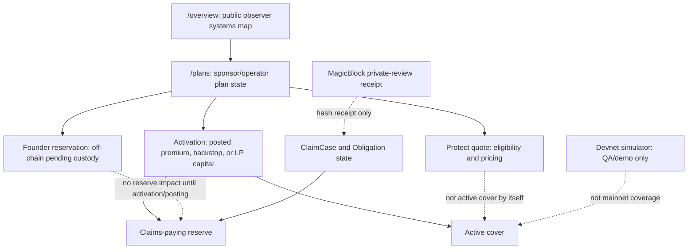

# OmegaX Protocol Design System

This is the UI/UX source of truth for the public OmegaX Protocol repository and
its Next.js protocol console in `frontend/`.

The console is not a marketing site, not a consumer checkout, and not a generic
crypto admin dashboard. It is a public protocol control room for sponsors,
operators, capital providers, auditors, oracle operators, and serious observers
who need to understand the current state without confusing pending custody with
active cover or claims-paying reserve.

## Product Job

The first useful action is understanding what the protocol can prove today:

- what is live on the selected network
- what is pending or operator-mediated
- what is devnet-only or simulated
- what is off-chain custody or external Protect flow
- what action a connected wallet can safely attempt

Every route must help a user answer one of those questions before it asks them
to sign, configure, or interpret protocol state.

## Visual Theme

- Atmosphere: industrial, calm, protocol-native, and audit-friendly.
- Density: 7/10. Dense enough for registers, ledgers, hashes, and route context;
  never so dense that financial state becomes hard to scan.
- Variance: 4/10. Use controlled asymmetry on `/overview`, then predictable
  workbench structure on operating routes.
- Motion: 3/10. Motion is status feedback, not decoration. Avoid deep animation
  unless it clarifies loading, live sync, or state transition.
- Shape: radius hierarchy is restrained. Repeated cards should stay at 8px or
  less unless an existing protocol surface already uses a larger semantic shell.
- Surface: prefer full-width workbench bands, tables, rails, and registers over
  card stacks. Do not nest cards inside cards.

## Brand Palette

The existing palette is the protocol brand baseline. Do not replace it with a
new palette unless the broader OmegaX brand direction explicitly changes.

- Protocol Canvas `#F8F9FA` - light app background.
- Protocol Canvas Dark `#0A1525` - dark app background.
- Ceramic Surface `rgba(234, 237, 239, 0.97)` - primary panels.
- Ceramic Surface Dark `rgba(17, 29, 47, 0.92)` - dark primary panels.
- Protocol Ink `#191C1D` - primary light-mode text.
- Protocol Ink Dark `#F0F1F2` - primary dark-mode text.
- Muted Slate `#495A63` / `#94A3B8` - secondary labels and descriptions.
- OmegaX Cyan `#33C5F4` - the single brand accent for active states, focus,
  network sync, and selected protocol context.
- Reserve Green `#19B47A` - semantic success only.
- Warning Amber `#F5A524` - semantic caution only.
- Risk Red `#BA1A1A` / `#FF7A7A` - semantic danger only.

Rules:

- Cyan is a surgical accent, not a fill color for every component.
- Green, amber, and red are never brand colors. Pair them with text or icons;
  never rely on color alone.
- Do not introduce purple, neon blue, beige, brown, orange, or one-note dark
  slate themes.
- No pure black. No outer neon glows. No gradient-orb decoration.

## Typography

The current font stack is intentional:

- Display: Newsreader for restrained editorial emphasis and large proof moments.
- UI sans: Space Grotesk for navigation, labels, body UI, and route chrome.
- Mono: Fira Code for hashes, addresses, timestamps, build stamps, and raw
  protocol amounts.

Rules:

- Use display type for first-level route framing only.
- Use smaller, tighter headings inside panels, rails, tables, and drawers.
- Numbers, hashes, addresses, and protocol identifiers should use mono or
  tabular-number treatment.
- Letter spacing must be 0 for normal prose. Uppercase micro-labels may use
  positive tracking only when already established locally.
- Do not scale font size with viewport width. Use explicit responsive steps.

## Route Responsibility Table

| Route | Primary user | Primary question answered | Allowed actions | Guardrails |
| --- | --- | --- | --- | --- |
| `/` | First-time observer | Where do I begin? | Redirect to `/overview` | Root must match docs and tests. |
| `/overview` | Public observer, sponsor, auditor | What is the system state and where should I go next? | Navigate to workbenches | Demo mode must be explicit via `?demo=1`. |
| `/plans` | Sponsor/operator | What plan, coverage product, claims, members, and treasury state exist? | Operator actions only when role-gated | No LP-capital language as sponsor budget. |
| `/plans/new` | Plan operator | What will this launch create and who signs? | Create configured protocol objects after review | No root product-type field, no hidden write consequences. |
| `/capital` | Capital provider, auditor | What capital is posted, allocated, queued, or impaired? | LP/operator actions when role-gated | Queue and pending values must never contradict. |
| `/claims` | Claims operator, auditor | Which claim cases need review and what reserve effect exists? | Contextual claim handoff only | Phase 0 operator-backed review must stay explicit. |
| `/members` | Sponsor/operator | Which wallets have coverage rights? | Redirect into `/plans?tab=members` | Member rights are not active cover by themselves. |
| `/governance` | Governance/operator | What controls, proposals, and authorities are active? | Scoped proposal/bootstrap actions | Disabled actions need reason and consequence. |
| `/oracles` | Oracle operator, auditor | Which operators, schemas, disputes, and staking states are visible? | Registry/profile actions when role-gated | No raw health data, only public proof metadata. |
| `/schemas` | Builder, auditor, governance | What outcome schemas and series comparability rules are live? | Schema governance handoff only | Schema mismatch is a route-level warning, not a blank state. |
| `/coverage/technical-terms` | Buyer, reviewer, operator | What public coverage technical terms are referenced? | Read-only | Genesis is bounded launch truth, not universal coverage. |
| `/coverage/risk-disclosures` | Buyer, reviewer, operator | What risks and reserve limits are disclosed? | Read-only | Claims-paying reserve must stay strictly defined. |
| `/magicblock-claim-room` | Reviewer, demo auditor | Is a private-review receipt verifiable? | Devnet receipt lookup only | Mainnet fails closed until separately approved. |
| `/pools/*`, `/staking` | Legacy users | Where did the old surface move? | Redirect only | No retired pool-first language in active UI. |

## State Map

Copy and UI labels must preserve this map. If a UI change makes any dotted edge
look like a solid edge, it is a high-severity product bug.

## Component Rules

- Buttons use icons when an icon exists. Use lucide icons in React components.
- Primary CTAs must name the action consequence, not just say "Continue".
- Disabled actions must explain the missing prerequisite next to the control.
- Every write path needs pre-sign review or an equivalent consequence summary.
- Loading states preserve layout with skeletons or stable panels.
- Empty states explain what is absent and where the user can go next.
- Error states fail closed. RPC failure is not an empty success state.
- Menus, drawers, disclosures, tabs, and filters must close on outside click,
  route change, and `Esc` where applicable.
- Long addresses middle-truncate in dense UI and expose full values in detail
  or title text.

## Responsive Rules

- Desktop is the primary operating surface. Mobile must remain good enough for
  review, inspection, and route navigation.
- No horizontal page scroll below 768px.
- Touch targets are at least 44px.
- Tables and registers must convert into stacked rows or scroll-contained
  regions with visible context labels.
- Footers and fixed chrome must never cover active route content.
- Text must never overflow buttons, pills, cards, or register rows.

## Accessibility Rules

- Every interactive control needs keyboard focus.
- Focus styles must be visible in light and dark modes.
- Status must not rely on color only.
- `aria-current`, `aria-expanded`, `aria-controls`, and `role` should be used
  for navigation, tabs, menus, and drawers.
- Reduced-motion preferences must disable decorative or continuous animation.

## Copy Rules

Use plain protocol truth:

- "Posted claims-paying reserve" for funds that can back claims now.
- "Pending custody" for Founder reservations before activation or posting.
- "Eligibility/pricing quote" for Protect quote state.
- "Active cover" only after coverage is actually activated.
- "Devnet demo" or "simulator" for non-mainnet proof flows.
- "Phase 0 operator-backed review" for current claim review posture.

Banned:

- Do not call pending reservations active cover.
- Do not call treasury inventory claims-paying reserve until posting rules pass.
- Do not describe devnet simulator activity as live mainnet coverage.
- Do not imply MagicBlock receipt verification settles claims or moves funds.
- Do not use vague hype copy like "next-gen", "seamless", "unleash", or
  generic trust claims without protocol evidence.

## Stitch Note

Stitch MCP was checked during the May 2026 polish pass. The API key and service
were healthy through `npx -y @_davideast/stitch-mcp@latest doctor`, but no
OmegaX Protocol-specific Stitch project or screen was available through callable
tools. The CLI project viewer exposed unrelated projects and then failed because
raw terminal mode is unavailable in this Codex environment; direct tool schema
calls also failed on a Stitch schema reference error. Treat Stitch as design
inspiration only for this pass.

## Anti-Slop Bans

- No landing-page shell for the protocol console.
- No generic crypto-dashboard hero.
- No card-inside-card layout.
- No decorative orbs, bokeh, or gradient blobs.
- No fake round-number proof claims.
- No stock imagery for protocol state.
- No hidden fallback from failed live reads to fixture-looking success.
- No public-safe docs or UI that mention private endpoints, private key paths,
  operator secrets, or machine-local evidence.
